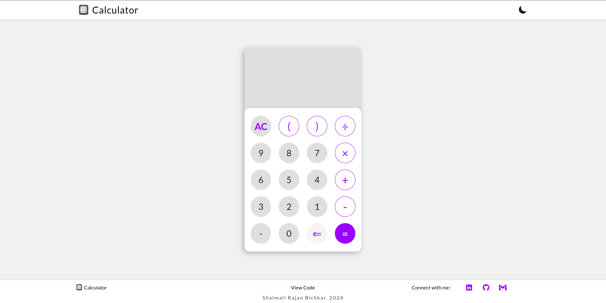
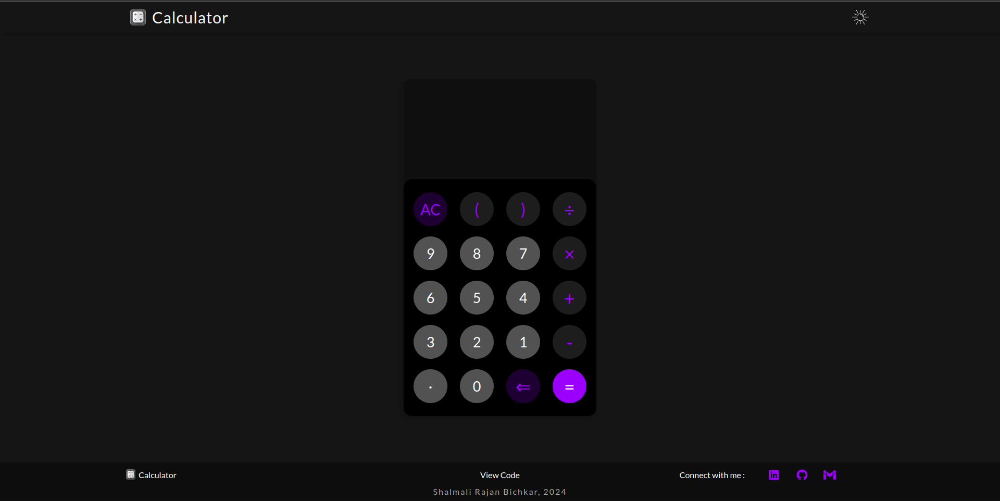
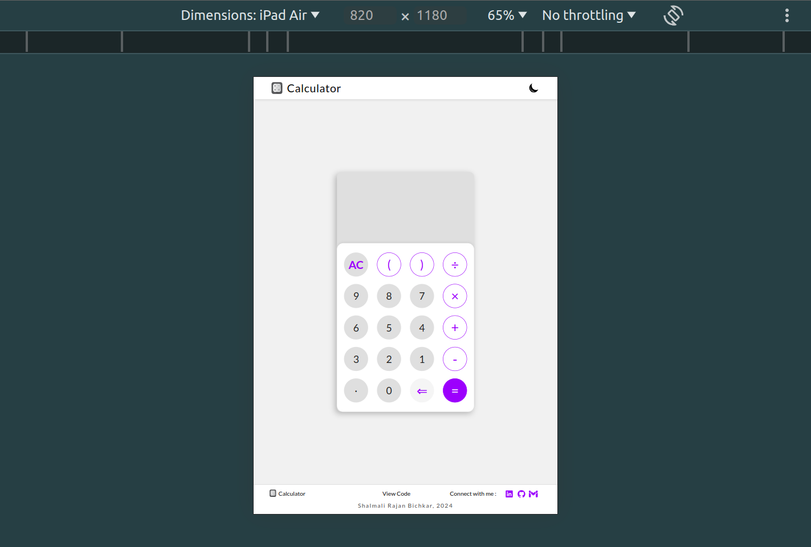
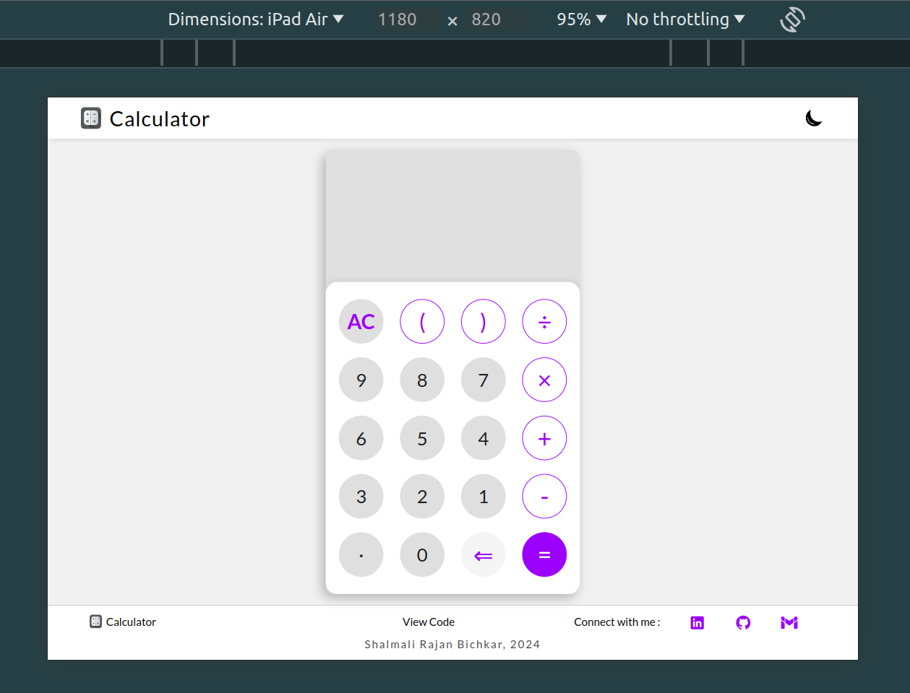
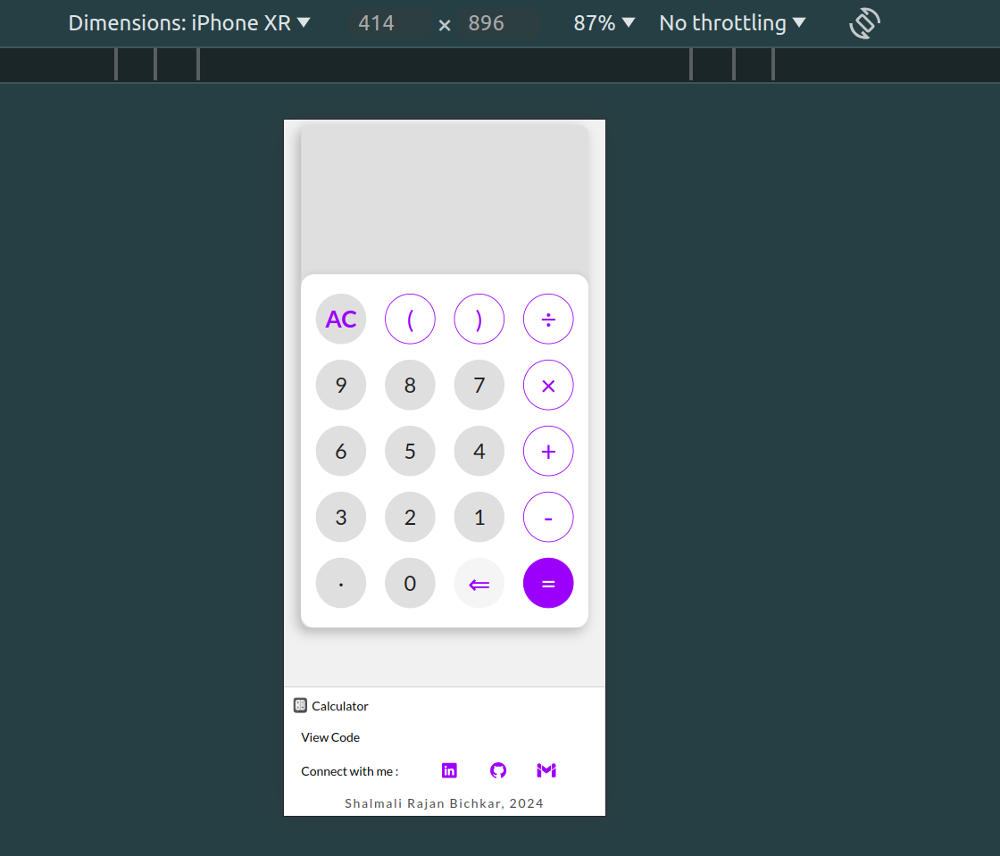
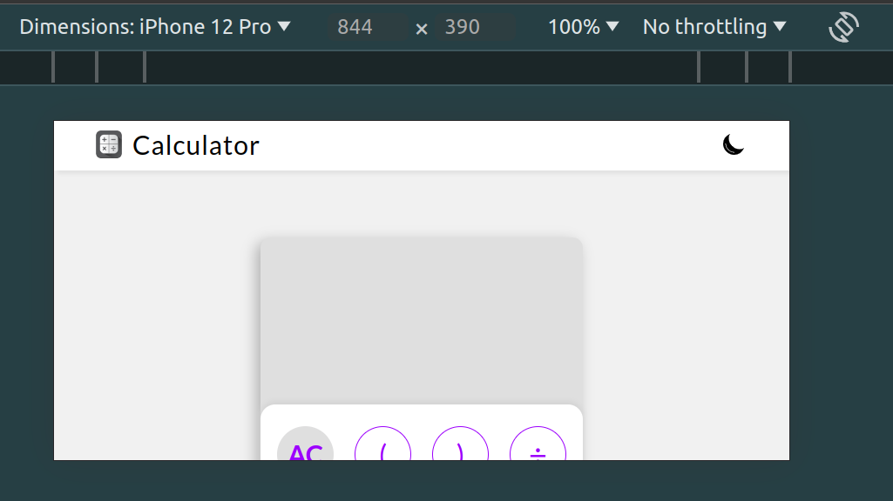
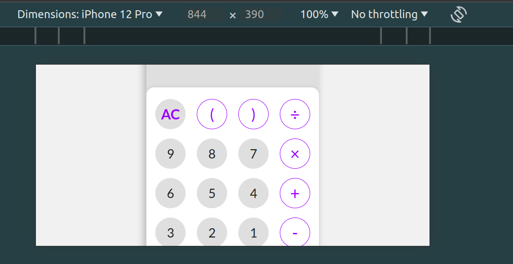
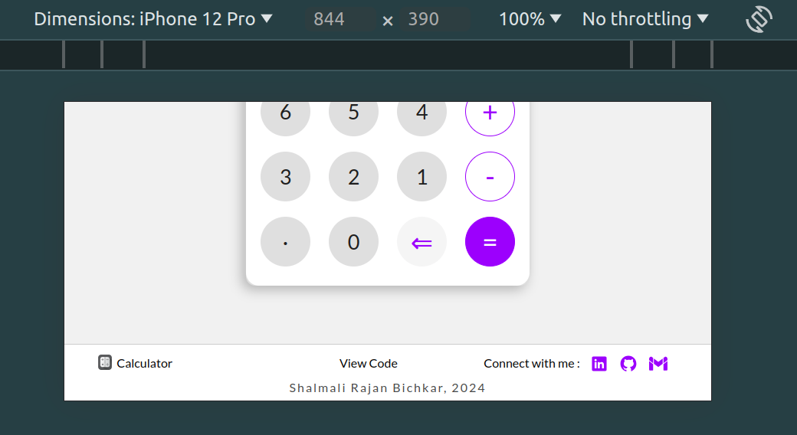

# Responsive Calculator Website 
## 1. Introduction - 
### I am currently a first year college student learning web development. I have made this website using HTML, CSS and JavaScript.
## 2. Description - 
### This is a fully responsive calculator website which includes the use of tools like flex and flexbox, media queries and toaster. The website is available in both DARK and LIGHT mode. Keyboard keys can can also be used to enter in values on the calculator

    -- the modes can be switched by clicking the sun/moon symbols at the top right corner 
    -- click on the equal to (=) button to get the answer (keyboard equivalent is enter key)
    -- the AC button clears the calculator display area 
    -- the back arrow (<=) removes a digit (keyboard equivalent is backspace key)

## 3. Design : 
### a) Computer
#### i) Light-theme

#### ii) Dark-theme

## b) Tablet
#### i) Vertical - 

#### ii) Horizotal - 

## c) Phone:
#### i) Vertical-

#### ii) Horizontal-
